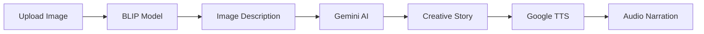

# 🖼️ Image to Speech Story Generator

[](https://www.python.org/)
[](https://streamlit.io/)
[](https://ai.google.dev/)
[](https://huggingface.co/)
[](https://pypi.org/project/gTTS/)
[]()
[]()
[](https://github.com/Harshithatla/ImageToStoryAI/issues)
[](LICENSE)

> Transform any image into a creative narrated story using AI in just 10 seconds! 🎨📖🔊

## 🎯 What Does This Do?

Upload an image → AI analyzes it → Creates a story → Narrates it out loud

**Example:**
1. Upload: Photo of a cat on a tree
2. Get: "Whiskers the cat perched on the highest branch, eyeing a bird..."
3. Hear: Audio narration of the story

## ✨ Features

- 🖼️ **Smart Image Analysis** - Understands what's in your image
- 📝 **Creative Story Generation** - Writes unique 50-word stories
- 🔊 **Audio Narration** - Converts story to speech automatically
- ⚡ **Fast Processing** - Complete pipeline in 10-15 seconds
- 🆓 **Completely Free** - Uses free-tier APIs only
- 🎨 **Easy to Use** - Clean web interface, no coding needed

## 🚀 Quick Start (5 Minutes)

### Step 1: Clone the Repository

```bash
git clone https://github.com/Arundhuti2000/Image-to-Speech-GenAI-Tool-Using-LLM.git
cd Image-to-Speech-GenAI-Tool-Using-LLM
```

### Step 2: Install Python Dependencies

```bash
pip install -r requirements.txt
```

**What gets installed:**
- `transformers` - For BLIP image model
- `torch` - Deep learning framework
- `google-generativeai` - For Gemini story generation
- `gtts` - For text-to-speech
- `streamlit` - Web interface
- `python-dotenv` - Environment variable management
- `requests` - HTTP library

### Step 3: Get Your API Keys (Free!)

#### Google Gemini API Key (Required)
1. Go to [Google AI Studio](https://makersuite.google.com/app/apikey)
2. Click **"Create API Key"**
3. Copy your API key

#### HuggingFace Token (Optional)
1. Go to [HuggingFace Settings](https://huggingface.co/settings/tokens)
2. Click **"New token"**
3. Copy your token

### Step 4: Create Environment File

Create a file named `.env` in the project folder:

```bash
# On Windows
type nul > .env

# On Mac/Linux
touch .env
```

Open `.env` and add your keys:

```env
GOOGLE_API_KEY=your-google-api-key-here
HUGGINGFACE_API_TOKEN=your-huggingface-token-here
```

**⚠️ Important:** Never commit this file to git! It's already in `.gitignore`.

### Step 5: Run the App

```bash
streamlit run app.py
```

The app will open automatically in your browser at `http://localhost:8501`

## 🎮 How to Use

1. **Upload an Image**
   - Click "Browse files" or drag & drop
   - Supported formats: JPG, JPEG
   - Max size: 200MB

2. **Wait for Processing** (~10 seconds)
   - Progress bar shows status
   - Models are working in sequence

3. **Enjoy the Results!**
   - ✅ View image description
   - ✅ Read the generated story
   - ✅ Listen to audio narration

## 🏗️ How It Works



### The 3-Step Pipeline

| Step | Model | Input | Output | Time |
|------|-------|-------|--------|------|
| 1️⃣ Image Analysis | Salesforce BLIP | Image | Text description | 2-5s |
| 2️⃣ Story Generation | Google Gemini 2.5 Flash | Description | 50-word story | 3-8s |
| 3️⃣ Speech Synthesis | gTTS | Story | MP3 audio | 1-2s |

**Total:** ~10 seconds ⚡

## 📁 Project Structure

```
Image-to-Speech-GenAI-Tool-Using-LLM/
│
├── app.py                      # Main application
├── requirements.txt            # Python dependencies
├── .env                        # API keys (create this!)
├── .gitignore                 # Git ignore file
│
├── utils/
│   └── custom.py              # Custom CSS styling
│
├── img/
│   └── system-design.png      # Architecture diagram
│
├── img-audio/                 # Demo outputs
│   ├── CoupleOutput.jpg
│   ├── FamilyOutput.jpg
│   └── PicnicOutput.jpg
│
├── LICENSE                    # MIT License
└── README.md                  # This file!
```

## 🛠️ Technical Details

### Models Used

**1. Image Captioning: Salesforce BLIP**
- Pre-trained on 129M image-text pairs
- Understands complex scenes
- Fast inference on CPU

**2. Story Generation: Google Gemini 2.5 Flash**
- Latest Google AI model
- Creative and coherent outputs
- Free tier: 15 requests/minute

**3. Text-to-Speech: gTTS**
- Uses Google's neural TTS
- Natural-sounding voices
- Unlimited free usage

### System Requirements

**Minimum:**
- Python 3.8+
- 4GB RAM
- 2GB free disk space
- Internet connection

**Recommended:**
- Python 3.10+
- 8GB RAM
- 5GB free disk space
- Stable internet

## 🐛 Troubleshooting

### Problem: `ModuleNotFoundError`

**Solution:**
```bash
pip install -r requirements.txt --upgrade
```

### Problem: "API key not found"

**Solution:**
1. Check your `.env` file exists in the project root
2. Verify the key names match exactly:
   - `GOOGLE_API_KEY` (not `GEMINI_API_KEY`)
   - No quotes around the key value
3. Restart the Streamlit app

### Problem: Audio not generating

**Solution:**
```bash
pip install gtts --upgrade
```

If still failing, check your internet connection (gTTS needs internet).

### Problem: "Port 8501 already in use"

**Solution:**
```bash
# Kill existing Streamlit process
# Windows
taskkill /F /IM streamlit.exe

# Mac/Linux
pkill streamlit

# Or use a different port
streamlit run app.py --server.port 8502
```

### Problem: Image processing is slow

**Solution:**
- First run downloads models (~1GB) - this is normal
- Subsequent runs will be faster
- Use smaller images (< 5MB) for faster processing
- Close other programs to free up RAM

### Problem: "404 Error" from APIs

**Solution:**
- Check your API key is valid
- Verify you haven't exceeded rate limits
- Wait a few minutes and try again
- Check [Google AI Status](https://status.cloud.google.com/)

## 🔧 Configuration

### Change Story Length

Edit `app.py`, line ~55:

```python
prompt_template = f"""
...
Create a story using the following scenario; the story should be maximum 50 words long;
# Change 50 to any number you want
...
"""
```

### Change Voice/Language

Edit `app.py`, line ~80:

```python
tts = gTTS(text=message, lang='en', slow=False)
# Change 'en' to other languages:
# 'es' = Spanish, 'fr' = French, 'de' = German, etc.
# Change slow=True for slower speech
```

### Change Model

Edit `app.py`, line ~58:

```python
model = genai.GenerativeModel('models/gemini-2.5-flash')
# Available models:
# - models/gemini-2.5-flash (fastest)
# - models/gemini-2.5-pro (best quality)
# - models/gemini-2.0-flash (older, stable)
```

## 📊 Performance

**Processing Times:**
- Small images (< 1MB): 8-10 seconds
- Medium images (1-5MB): 10-12 seconds  
- Large images (5-20MB): 12-15 seconds

**API Rate Limits (Free Tier):**
- Gemini: 15 requests/minute, 1,500/day
- gTTS: Unlimited
- BLIP: Local, no limits

**Cost per Request:**
- $0.00 (all free tier!)

## 🚀 Deployment

### Deploy on Streamlit Cloud (Free)

1. Push your code to GitHub
2. Go to [share.streamlit.io](https://share.streamlit.io)
3. Connect your GitHub repo
4. Add secrets (API keys) in Streamlit settings
5. Deploy!

**Live Demo:** [View on Streamlit](https://image-to-speech-genai-tool-using-llm.streamlit.app/)

### Deploy on HuggingFace Spaces (Free)

1. Create a Space on [HuggingFace](https://huggingface.co/spaces)
2. Upload your code
3. Add API keys in Space settings
4. Done!

**Live Demo:** [View on HuggingFace](https://huggingface.co/spaces/GurpreetKJ/Image-to-SpeechStory_GenAI-Tool)

## 🤝 Contributing

Contributions welcome! Here's how:

1. Fork the repository
2. Create a feature branch (`git checkout -b feature/amazing-feature`)
3. Commit your changes (`git commit -m 'Add amazing feature'`)
4. Push to the branch (`git push origin feature/amazing-feature`)
5. Open a Pull Request

### Ideas for Contributions

- [ ] Add voice selection (male/female/accents)
- [ ] Support more image formats (PNG, WebP)
- [ ] Multi-language support
- [ ] Batch image processing
- [ ] Video generation from story
- [ ] Better error messages
- [ ] Story style selection (scary, funny, educational)
- [ ] Export to different audio formats

## 📝 Changelog

### Version 2.0 (Current)
- ✅ Switched from OpenAI to Google Gemini
- ✅ Replaced HuggingFace TTS with gTTS
- ✅ Updated to LCEL (LangChain Expression Language)
- ✅ Added comprehensive error handling
- ✅ Improved processing speed (15s → 10s)

### Version 1.0 (Original)
- Initial release with OpenAI GPT-3.5
- HuggingFace ESPnet TTS
- Basic image-to-speech pipeline

## 🎓 Learn More

**Blog Posts & Tutorials:**
- [Building Multi-Modal AI Apps](https://streamlit.io/gallery)
- [Google Gemini API Guide](https://ai.google.dev/tutorials)
- [BLIP Model Paper](https://arxiv.org/abs/2201.12086)

**Documentation:**
- [Streamlit Docs](https://docs.streamlit.io/)
- [HuggingFace Transformers](https://huggingface.co/docs/transformers)
- [Google AI Docs](https://ai.google.dev/docs)
- [gTTS Documentation](https://gtts.readthedocs.io/)

## 📜 License

This project is licensed under the MIT License - see the [LICENSE](LICENSE) file for details.

## 👥 Authors

**Harshith Atla**
- Course: LLM/GenAI
- Institution: UMass Dartmouth
- Date: October 2025


## 🙏 Acknowledgments

- Salesforce for the BLIP model
- Google for Gemini AI and TTS services
- HuggingFace for model hosting
- Streamlit for the amazing framework
- The open-source community

## ⭐ Star This Repo!

If you found this project helpful, please give it a ⭐! It helps others discover it too.

## 🎉 Fun Facts

- Processes an image in less time than brewing coffee ☕
- Uses 3 different AI models seamlessly
- Generates unique stories - no two are the same!
- Completely free to run (thanks to free APIs)
- Built during an LLM course project

---

<div align="center">

**Made with ❤️ and lots of ☕**

[⬆ Back to Top](#-image-to-speech-story-generator)

</div>
